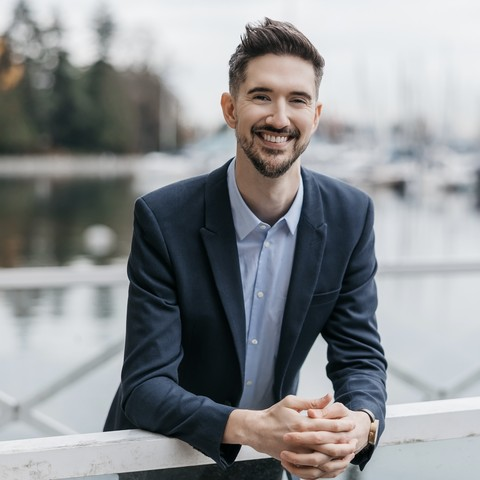

::: {.hero}

::: {.hero-photo}
{fig-alt="Portrait of Ian Gault"}
:::

::: {.hero-text}

::: {.hero-name}
Ian Gault
:::

# A scientist who builds data systems. {.hero-headline .unnumbered .unlisted}

::: {.hero-credentials}
MSc Analytical & Environmental Toxicology (U of A) · Master of Data Science (UBC) · Registered Professional Biologist (RPBio)
:::

::: {.hero-tagline}
I build pipelines, models, apps, and reports for laboratory, clinical, and environmental data. I started at the bench in analytical toxicology, so I understand how the numbers were made before I model them.
:::

::: {.hero-buttons}
[See my projects](projects/index.qmd){.btn .btn-primary}
[Resume](resume.qmd){.btn .btn-outline-secondary}
[Get in touch](https://www.linkedin.com/in/gaultian){.btn .btn-outline-secondary}
:::

:::

:::

::: {.proof-strip}

::: {.proof-item}
[30+ projects]{.proof-lead}

of analysis and reporting over six years of regulated monitoring and risk assessment for oil sands, mining, municipal wastewater, and contaminated sites, including a US EPA Superfund site. I develop reusable, modular workflows that make each analysis faster and easier to extend to future projects.
:::

::: {.proof-item}
[Research scientist training]{.proof-lead}

study design, biotic and abiotic environmental field sampling, sample extraction, mass spectrometry, bioanalytical methods, cell culture, water chemistry, toxicology, and human research, with 2 peer-reviewed publications and a hospital research partnership in IBD.
:::

::: {.proof-item}
[Modern data science]{.proof-lead}

statistical modelling (descriptive, inferential, and Bayesian), machine learning (classification, clustering, and deep learning), spatial and temporal analysis, data visualization, data infrastructure (cloud computing on AWS, CI/CD, PySpark, and DuckDB), and LLM tooling.
:::

:::

::: {.principle}
Data are observations of the real world; models are abstractions of it. Good data science connects the two through careful measurement, rigorous modelling, and thoughtful interpretation.
:::

::: {.how-i-work}

## How I work

From how the data were generated to the decisions they support.

::: {.pipeline}

::: {.step}
[Measure]{.step-label}

Start with how the data were generated: instruments, detection limits, and sampling design.

[For example]{.step-eg} [MSc research in analytical toxicology](scientific-communication.qmd){.step-link}
:::

::: {.step}
[Engineer]{.step-label}

Turn messy, multi-source data into reproducible, tested pipelines.

[For example]{.step-eg} [Water Quality Harmonization](projects/wq-harmonization/index.qmd){.step-link}
:::

::: {.step}
[Model]{.step-label}

Match the model to the data and check its assumptions before trusting the result.

[For example]{.step-eg} [Modelling Beyond a Straight Line](projects/vignette-non-linear-trends/index.qmd){.step-link}
:::

::: {.step}
[Deploy]{.step-label}

Build reports, dashboards, and apps.

[For example]{.step-eg} [IBD Mycobiome Dashboard](projects/ibd-mycobiome-dashboard/index.qmd){.step-link}
:::

::: {.step}
[Decide]{.step-label}

Communicate results clearly enough to support regulatory, environmental, and business decisions.

[For example]{.step-eg} [Six years of consulting](resume.qmd#experience){.step-link}
:::

:::

:::

::: {.featured}

## Featured projects

::: {#featured-projects}
:::

[See all projects →](projects/index.qmd){.see-all}

:::

::: {.looking-for}

## What I'm looking for

I'm looking for roles where I'm responsible for the pipelines and analysis behind scientific decisions, on teams working with lab, clinical, or environmental data.

::: {.hero-buttons}
[Email me](mailto:iggault@gmail.com){.btn .btn-primary}
[LinkedIn](https://www.linkedin.com/in/gaultian){.btn .btn-outline-secondary}
[Download Resume](media/Ian_Gault_Resume.pdf){.btn .btn-outline-secondary download="Ian_Gault_Resume.pdf"}
:::

:::
