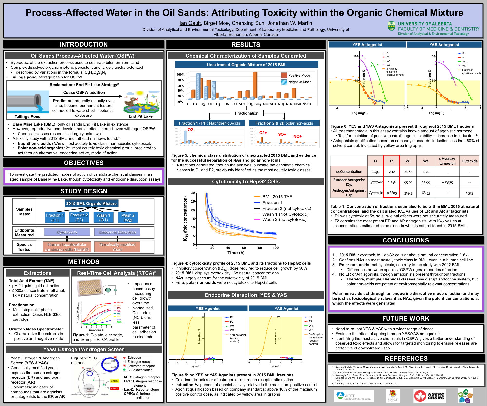

## Publications

Gault IGM. **Toxicity and Chemical Characterization of Oil Sands Process-Affected Water Using Cell-Based Assays and Orbitrap Mass Spectrometry.** MSc Thesis, University of Alberta, 2019. [University of Alberta Scholaris](https://ualberta.scholaris.ca/items/702d7d4c-fc4d-46ee-9803-c47e67620c94)

Gault IGM, Sun C, Martin JW. **Persistent Cytotoxicity and Endocrine Activity in the First Oil Sands End-Pit Lake.** *ACS EST Water* 2023, 3(2), 366–376. DOI: [10.1021/acsestwater.2c00430](https://doi.org/10.1021/acsestwater.2c00430)

Morandi GD, Wiseman SB, Pereira A, Mankidy R, Gault IGM, Martin JW, Geisy JP. **Effects-Directed Analysis of Dissolved Organic Compounds in Oil Sands Process-Affected Water (OSPW).** *Environmental Science & Technology* 2015, 49(20), 12395–12404. DOI: [10.1021/acs.est.5b02586](https://doi.org/10.1021/acs.est.5b02586)

---

## Conference Presentations

**SETAC North America** — Sacramento, CA (Nov 2018)
Oral: *Endocrine Activity of Oil Sands Process-Affected Water: Evaluating Ageing as a Remediation Strategy.*

**SETAC-Prairie Northern Chapter Conference** — Edmonton, AB (Jun 2018)
Oral: *Process-Affected Water in the Oil Sands Industry: Toxicity Attribution and Evaluating Ageing as a Remediation Strategy.*

**Canadian Chemistry Conference** — Edmonton, AB (May 2018)
Oral: *Process-Affected Water in the Oil Sands Industry: Toxicity Attribution and Evaluating Ageing as a Remediation Strategy.*

**Canadian Chemistry Conference** — Toronto, ON (May 2017)
Oral: *Process-Affected Water in the Oil Sands Industry: Toxicity Attribution and Evaluating Ageing as a Remediation Strategy.*

**DRIvE Days — Laboratory Medicine & Pathology Conference** — Edmonton, AB (2018)
Poster: *Process-Affected Water in the Oil Sands: Attributing Toxicity within the Organic Chemical Mixture.*

{width="320px" .lightbox style="border:1px solid #ccc; border-radius:4px; cursor:zoom-in;"}

---

## Presentation Awards

| Year | Conference | Award |
|------|------------|-------|
| 2018 | SETAC North America | 3rd Place, Best Student Presentation (Masters category) |
| 2018 | SETAC-Prairie Northern Chapter | 1st Place, Best Student/PDF Oral Presentation |
| 2018 | Canadian Chemistry Conference | Outstanding Graduate Oral Presentation |
| 2017 | Canadian Chemistry Conference | Bell McLeod Educational Fund Award; GSA Academic Travel Award |
